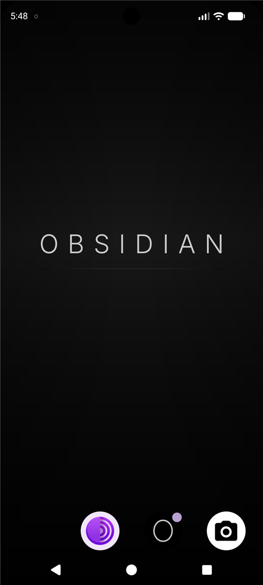
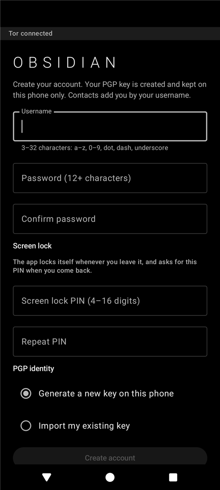
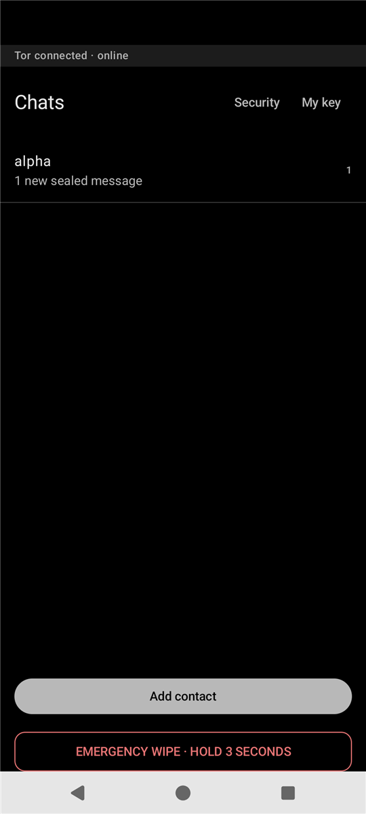
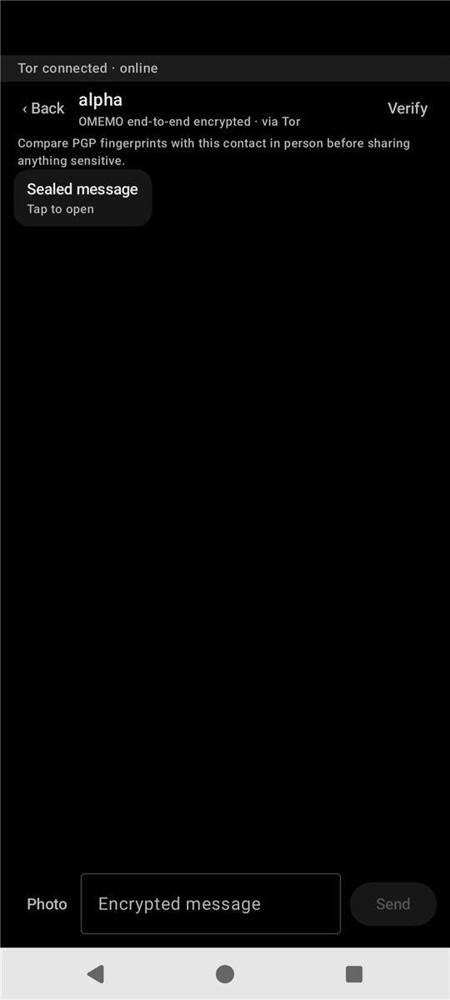
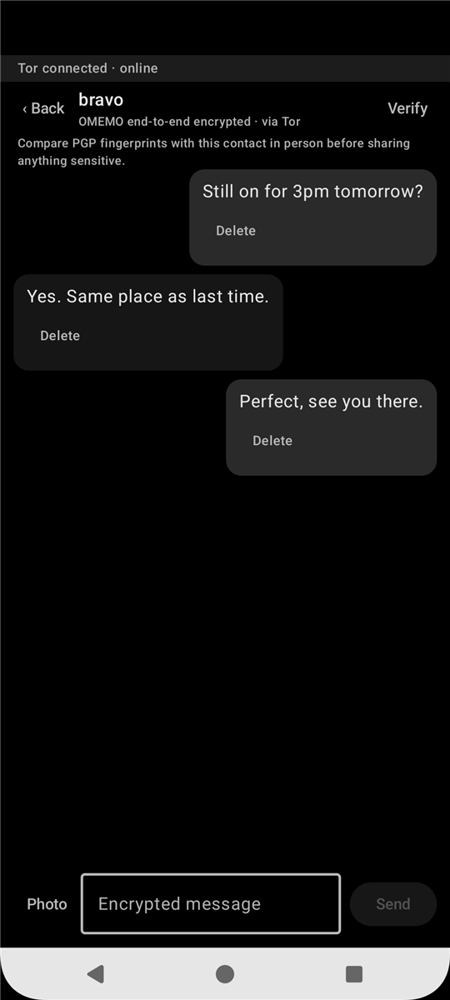
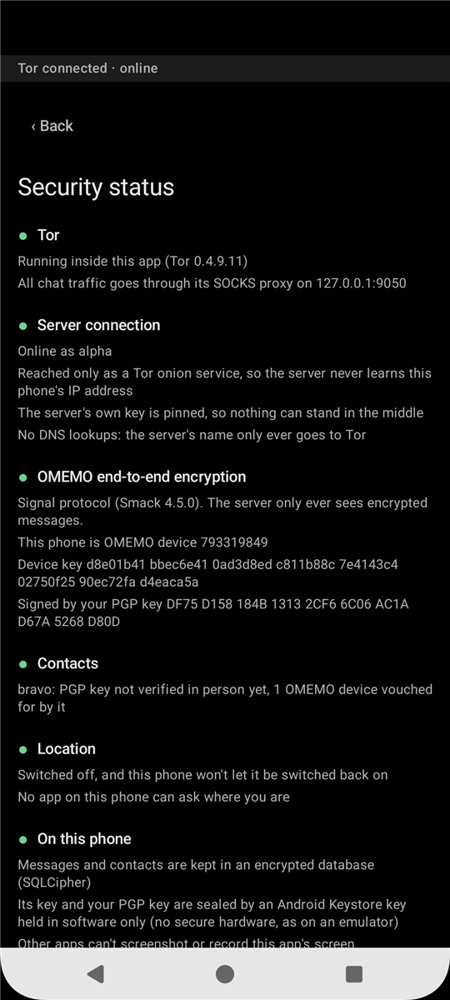
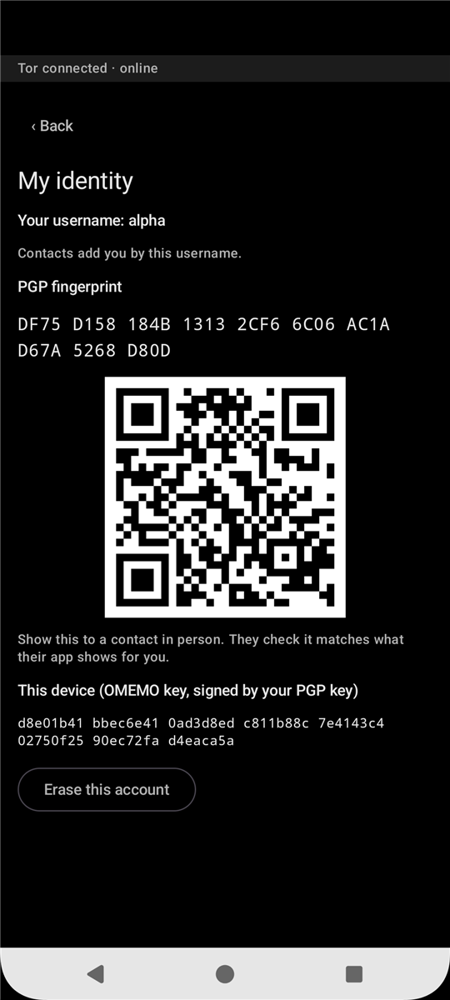
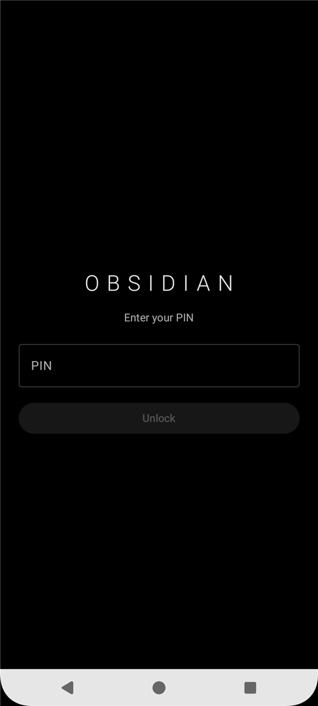

# OBSIDIAN

A privacy-first Android phone. It does three things: encrypted chat, private browsing over Tor,
and a camera. It is built to reveal and keep as little as possible. There is no phone dialler, no
SMS, and location is switched off and locked.

This repository contains everything that makes the phone OBSIDIAN: the chat app, the changes
applied to the operating system, and the module the chat server uses.

## Get it

Test releases run on the Google Pixel 8, and installing one erases the phone.

- [Install from your browser](https://obsidianos.org/web-install.html), in Chrome, Edge or Brave on
  a computer. It finds the release for your phone, checks it and installs it.
- [Downloads](https://obsidianos.org/downloads.html): every release with its size and SHA-256, for
  installing from a computer or keeping a copy.
- [How to install](https://obsidianos.org/install.html), step by step, including how to go back to
  normal Android.

Releases are signed with test keys for now, so the bootloader stays unlocked and the phone shows a
warning each time it starts. Do not lock the bootloader: a phone locked to an operating system it
cannot verify refuses to start.

## Screenshots

<table>
  <tr>
    <td align="center"><br><sub>Three apps, nothing else</sub></td>
    <td align="center"><br><sub>Create an account</sub></td>
    <td align="center"><br><sub>New messages arrive sealed</sub></td>
    <td align="center"><br><sub>Tap to open</sub></td>
  </tr>
  <tr>
    <td align="center"><br><sub>OMEMO, over Tor</sub></td>
    <td align="center"><br><sub>Security status</sub></td>
    <td align="center"><br><sub>Verify in person</sub></td>
    <td align="center"><br><sub>App PIN lock</sub></td>
  </tr>
</table>

<sub>Screenshots are from the emulator build.</sub>

## What's here

| Folder | What it is |
|---|---|
| [`obsidian-chat/`](obsidian-chat) | **Obsidian Chat**, the messaging app (Kotlin, Jetpack Compose) |
| [`obsidian-os/`](obsidian-os) | Scripts that turn an Android Open Source Project source tree into the OBSIDIAN image |
| [`obsidian-server/`](obsidian-server) | The Prosody module the chat server uses to look up usernames |
| [`branding/`](branding) | Boot screen artwork |

## The phone

- **Three apps:** Obsidian Chat, Tor Browser and the camera, plus Settings. Nothing else.
- **No calls or texts:** the dialler and messaging apps are removed from the image.
- **Location off, for good:** Obsidian Chat is the phone's device owner and holds location
  switched off, with the switch taken away.
- **A screen lock is required:** the app will not open until the phone has a PIN.
- **No side-loading:** installing apps from unknown sources is disabled.
- **Emergency wipe:** hold the button on the chat screen for three seconds to erase the phone and
  return it to factory settings.
- **Three-button navigation**, so Back and Home are always visible.

## Obsidian Chat

- **Tor only.** Every connection goes through Tor, including DNS, and the server is reachable only
  as an onion service. The app refuses to start if a network DNS resolver could leak a lookup.
- **End-to-end encrypted.** Messages use OMEMO, the Signal protocol. Each person's identity is a
  PGP key created on the phone and never leaves it. The OMEMO devices are bound to that key and
  can be compared in person.
- **Add people by username.** No phone numbers or email addresses.
- **Sealed messages.** Messages arrive closed and open only when tapped. The chat list shows how
  many are waiting.
- **Photos without metadata.** Photos are re-encoded to remove location, camera and other
  metadata before they are encrypted and sent. If that cannot be confirmed, the photo is not sent.
- **Encrypted at rest.** The database is SQLCipher, and its keys are sealed by the Android Keystore.
- **App PIN.** The app locks itself whenever you leave it.
- **Delete for both sides.** Deleting a message also retracts it on the other phone.

## What the server can and cannot see

The server runs [Prosody](https://prosody.im) as a Tor onion service, with no message archive.

- **It cannot read messages or photos.** They are end-to-end encrypted before they leave the phone.
- **It does know** which usernames exist and who has added whom. It also holds each account's
  public keys, which is necessary for delivery.
- **It does not know** a phone's IP address, because every connection arrives over Tor.

## Accounts cannot be recovered, by design

An account's keys and password exist only on its phone. If the phone is wiped, including by the
emergency wipe, or lost, that account is gone for good. Register a new one.

## Building

### Obsidian Chat

You need JDK 21 and the Android SDK with the `android-37.0` platform.

Point the app at your server in `obsidian-chat/local.properties`. This file is never committed, so
no server address appears in the source:

```properties
obsidian.serverDomain=<your server's .onion address>
obsidian.serverSpkiSha256=<base64 SHA-256 of the server's TLS public key>
```

The key pin can be computed from the server's certificate:

```bash
openssl x509 -in cert.pem -pubkey -noout | openssl pkey -pubin -outform der \
  | openssl dgst -sha256 -binary | base64
```

Then run the tests and build:

```bash
cd obsidian-chat
./gradlew testDebugUnitTest assembleDebug
```

`tools/emulator-test/` has scripts for trying two phones against each other on emulators.

### The OS image

`obsidian-os/scripts/obsidian-os-changes.sh` applies the OBSIDIAN changes to a synced source tree.
It works for the emulator, and for the Pixel 8 (`shiba`) after that device's vendor files have
been generated. The header of the script describes each step and why it is done the way it is.
Building a phone image needs a Linux machine with a lot of disk space (plan for 300 GB or more),
and takes many hours.

Test builds are signed with test keys, which means the phone's bootloader stays unlocked. They are
for development only. Release builds must be signed with keys that are generated and kept offline.

### Server

Install Prosody, publish it as a Tor onion service, and load `mod_obsidian_lookup` from
`obsidian-server/prosody/`. Leave out message archive (MAM) and offline storage modules.

## Status

Early development. The chat app and the OS changes have been tested end to end on emulators, and
the first Pixel 8 build is under way.

## License

[GPL-3.0](LICENSE). Obsidian Chat uses the Signal protocol library through
`smack-omemo-signal`, which is licensed under GPLv3, so the app is GPLv3 as well. Third-party
components keep their own licenses.
